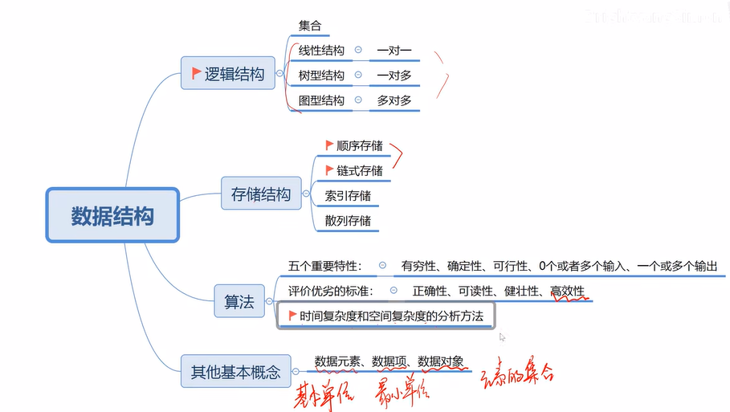

# 概论
> 
> —— [BrightyangSimon](https://space.bilibili.com/523126822)

## 什么是数据结构
> 数据结构是一门研究**非数值运算**的程序设计问题中计算机的操作对象以及它们之间的关系和操作等的学科

## 基本概念和术语
1. **数据（data）**：对计算机科学而言，数据的含义几位管饭，如图像、声音等都可以通过编码而归之于数据的范畴
2. **数据元素（data element）**：数据的**基本单位**，一个数据元素可以由多个**数据项（data item）** 组成
3. **数据项**：数据的不可分割的**最小单位**
    > ### 用例
    > 以下面的学生列表为例：
    > | 姓名 | 学院             | 班级        | 学号  |
    > | ---- | ---------------- | ----------- | ----- |
    > | 小明 | 数学与计算机学院 | 计算机216班 | 21663 |
    > | 小亮 | 数学与计算机学院 | 计算机215班 | 21523 |
    > | 小红 | 数学与计算机学院 | 计算机213班 | 21311 |
    > | ... |
    > 
    > 列表中的每一排都是一个数据元素，其中姓名、学院、班级、学号都是不可再分割的数据项

4. **数据对象（data object）**：**性质相同的数据元素**的集合
5. **数据结构（data structure）**：**相互之间存在一宗或多种特定关系的数据元素**的集合，**数据元素**之间的关系就称为**结构（structure）**。根据数据元素之间关系的不同特性，通常有四类基本结构：**集合**、**线性结构**、**树形结构**、**网/图状结构**
6. 数据结构的形式定义为一个二元组：
    $$ Data Structure = (D,S) $$
   + D：数据元素的有限集
   + S：数据元素之间关系的有限集
7. 上面数据结构的定义中的 `S`，以及说到的四类基本结构（集合、线性结构、树形结构、网/图状结构），都是从操作对象种抽象出来的数据模型，被称为**逻辑结构**。这些结构在计算机中的表示（也称映像）称为**物理结构**，又称**存储结构**
8. 数据元素之间的关系（structure），在计算机中有两种不同的表示方法：顺序映像和非顺序映像，由此，存储结构分为两类：**顺序存储结构**和**链式存储结构**。
9. 如何描述存储结构？
   1.  底层上涉及数据元素在存储器中的物理位置
   2.  在高级语言中，一般可以用“一维数组”表示顺序存储结构，“指针”表示链式存储结构
